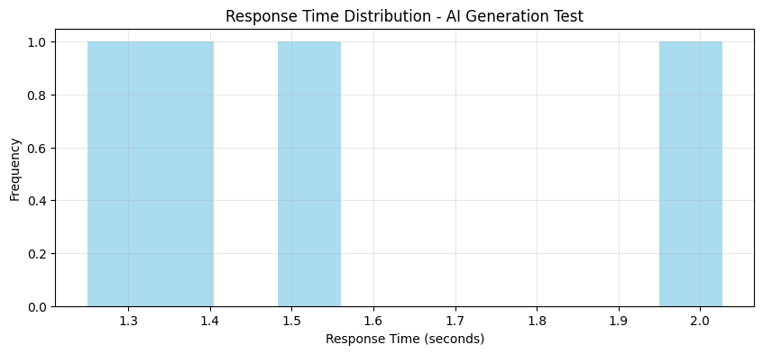
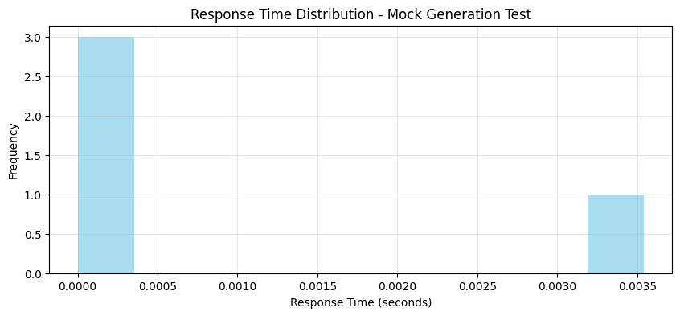

# AI Test Case Generator Performance Report

## 📊 Test Summary

| Test Name | Model | Total Cases | Success | Failed | Avg Time (s) | Min Time (s) | Max Time (s) | Throughput (req/s) |
|-----------|-------|-------------|---------|--------|--------------|--------------|--------------|-------------------|
| AI Generation Test | llama-3.1-8b-instant | 4 | 4 | 0 | 1.56 | 1.25 | 2.03 | 0.64 |
| Mock Generation Test | llama-3.1-8b-instant | 4 | 4 | 0 | 0.00 | 0.00 | 0.00 | 1129.32 |

## 📝 Detailed Results

### 🚀 AI Generation Test (llama-3.1-8b-instant)
- **Total Test Cases:** 4
- **Successful Runs:** 4
- **Failed Runs:** 0
- **Average Response Time:** 1.56s
- **95th Percentile Response Time:** 2.38s
- **Throughput:** 0.64 requests/second
- **Total Tokens Generated:** 1,806

### 🚀 Mock Generation Test (llama-3.1-8b-instant)
- **Total Test Cases:** 4
- **Successful Runs:** 4
- **Failed Runs:** 0
- **Average Response Time:** 0.00s
- **95th Percentile Response Time:** 0.01s
- **Throughput:** 1129.32 requests/second
- **Total Tokens Generated:** 1,963

