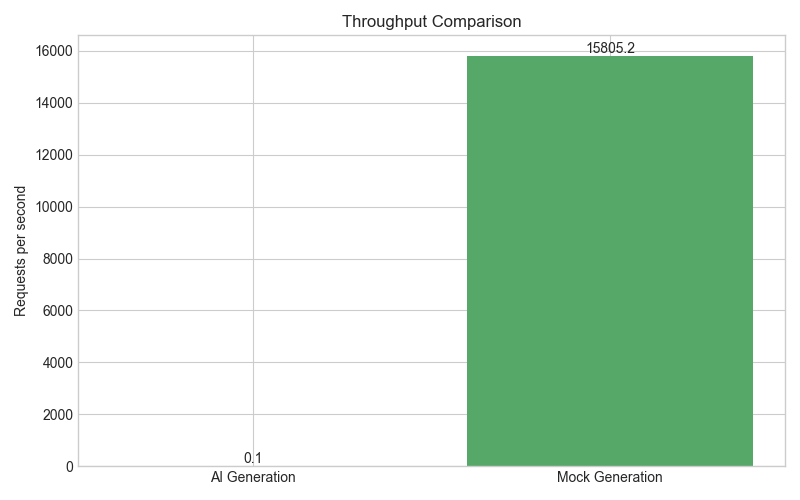

# 🚀 Test Case Generator - Performance Test Report

**Report Generated:** 2025-09-21 18:10:03  
**Environment:** Python 3.11.0; Windows 10

## 📊 Test Summary

| Test Name | Total | Success | Failed | Avg Time (s) | Throughput (req/s) |
|-----------|-------|---------|--------|--------------|-------------------|
| AI Generation (Full Suite) | 8 | 8 | 0 | 9.606 | 0.10 |
| Mock Generation (Full Suite) | 8 | 8 | 0 | 0.000 | 15805.20 |

## 📈 Performance Analysis

### Response Time Comparison

### Throughput Comparison

### Resource Usage

#### CPU Usage Comparison

#### GPU Usage Comparison

## 📝 Detailed Results

### AI Generation Test

No data available for AI Generation Test

### Mock Generation Test

No data available for Mock Generation Test

---

*Report generated by AI Test Case Generator Performance Test Suite*
